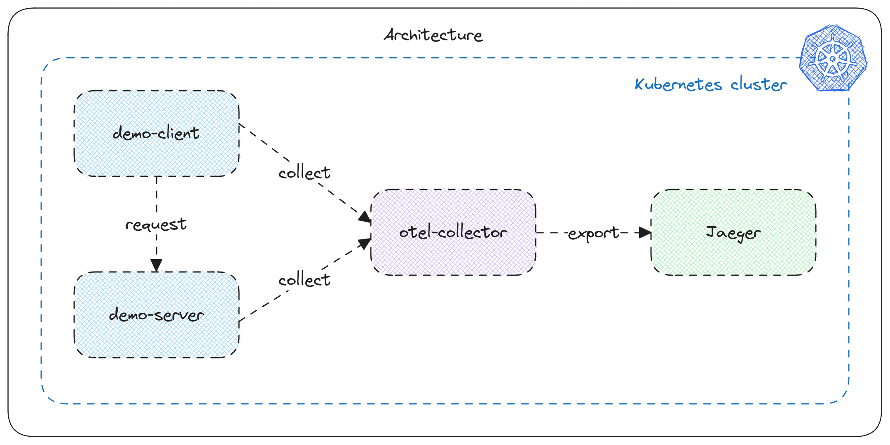

# Tracing Exercise

Cet exercice est basé sur cette [démo](https://github.com/open-telemetry/opentelemetry-collector-contrib/tree/main/examples/demo).

## Objectif

Cet exercice a pour but de vous familiariser avec le tracing distribué dans Kubernetes.

Voici les objectifs de cet exercice :
- Déployer un serveur et un client qui communiquent entre eux et sont instrumentés avec opentelemetry
- Déployer un collecteur opentelemetry
- Déployer une instance de [Jaeger](https://www.jaegertracing.io/)
- Connecter le collecteur à Jaeger
- Visualiser et explorer les traces dans Jaeger

## Contenu du repo

- `src/` : code du serveur et du client (en GO)
- `kubernetes/` : manifests Kubernetes à déployer

## Prérequis

- La CLI [kubectl](https://kubernetes.io/docs/reference/kubectl/)
- git
- Connaissances basiques de Kubernetes

## Exercice

### Mise en place

- Cloner ce repository
- Récupérer le fichier kubeconfig du cluster playground auprès de votre formateur OU lancer un cluster local avec l'aide de [kind](https://kind.sigs.k8s.io/docs/user/configuration/) par exemple
- Configurer la variable d'environnement KUBECONFIG pour cibler le cluster playground
- Tester la connexion à Kubernetes avec la commande `kubectl get nodes`

En cas de blocage, une solution pour les différents composants à configurer est disponible sur la branche `solution` de ce repository.

### Déploiement du serveur et du client

Nous allons déployer un serveur et un client écrits en Go. Le client va régulièrement appeler le serveur.

- Déployer le serveur et le client (dans `kubernetes/client.yaml` et `kubernetes/server.yaml`)
  - Vérifier leurs logs : ils doivent afficher des messages d'erreur car ils ne peuvent pas contacter le collecteur opentelemetry
- Déployer le collecteur opentelemetry
  - Le déploiement devrait bien se passer, mais le serveur et le client sont toujours en erreur, pourquoi ?
- Vérifier dans les manifests Kubernetes du client et du serveur : quelle variable peut-on modifier pour changer l'adresse du collecteur opentelemetry ?
  - Modifier cette variable et redéployer le client et le serveur, vérifier leurs logs
  - Vérifier les logs du collecteur opentelemetry, des logs à propos de traces et de metrics devraient apparaître

### Déploiement de Jaeger

Nous allons maintenant déployer Jaeger pour visualiser les traces envoyées par le collecteur opentelemetry.

[Jaeger](https://www.jaegertracing.io/) est un outil de tracing open source. Il permet de visualiser les traces envoyées par des applications instrumentées avec opentelemetry.

- Déployer jaeger (dans `kubernetes/jaeger.yaml`)
- Vérifier qu'il démarre correctement
- Lancer un port-forward pour accéder à l'interface web de jaeger (port 16686)
  - Les traces sont elles visibles dans l'interface web de jaeger ?

### Connexion du collecteur opentelemetry à Jaeger

Nous allons maintenant connecter le collecteur opentelemetry à Jaeger pour que les traces soient envoyées à Jaeger.

- Modifier le manifest du collecteur opentelemetry pour qu'il envoie les traces à Jaeger
  - Ouvrir le manifest du collecteur opentelemetry
  - Trouver les bons éléments à configurer pour ajouter Jaeger comme destination pour les traces ([documentation](https://opentelemetry.io/docs/collector/configuration/#basics))
- Redéployer le manifest du collecteur opentelemetry
  - Le pod n'est pas redéployé suite à cette opération, il faut le supprimer et le recréer
  - Il est également possible d'installer [Reloader](https://github.com/stakater/Reloader) pour que les pods soient redéployés automatiquement lorsqu'une configmap est modifiée : `kubectl apply -f https://raw.githubusercontent.com/stakater/Reloader/master/deployments/kubernetes/reloader.yaml`
  - Quelle annotation dans le manifest du collecteur opentelemetry permet de redéployer le pod lorsqu'une configmap est modifiée ?
- Vérifier que Jaeger reçoit des traces
  - Si ce n'est pas le cas, vérifier les logs du collecteur opentelemetry
  - Si une erreur TLS survient
  - Si vous ne trouvez pas, cette [configuration](https://github.com/open-telemetry/opentelemetry-collector-contrib/blob/main/examples/demo/otel-collector-config.yaml) peut vous aider
- Si Jaeger reçoit des traces, vous pouvez prendre le temps d'explorer l'interface
  - Pourquoi est-ce que la durée des traces varient fortement ? Repérez quel service pourrait le causer et identifier la ligne de code qui cause ce problème
  - Afficher le graphe des services

Vous avez terminé l'exercice !

Après l'exercice, même en ne connaissant pas bien le langage Go, n'hésitez pas à consulter le code du client et du serveur (fichiers `main.go`) pour voir comment ils sont instrumentés avec opentelemetry.

Voici quelques questions permettant de comprendre ce qu'il s'y passe :

- Repérez les lignes de code dans le client qui permettent faire un appel au serveur
  - Quel objet est passé dans la requête HTTP ?
  - Quel rapport a-t-il avec le tracing ? Pouvez vous repérer la ligne de code permettant de débuter le span ?
  - Comment le serveur récupère-t-il l'objet permettant de continuer la trace ?
  - Quel champ dans l'objet permettrait-t-il de relier les spans pour constituer une trace ?
- Essayez de repérer des champs initialisés dans le code qui se retrouvent dans les traces envoyées à Jaeger

## Pour aller plus loin

Si vous souhaitez aller plus loin, une demo avec beaucoup plus de microservices est installable [ici](https://opentelemetry.io/docs/demo/).

Vous pouvez tester l'installation avec [kubectl](https://opentelemetry.io/docs/demo/kubernetes-deployment/#install-using-kubectl), puis naviguer dans l'autre instance Jaeger pour essayer de visualiser les interactions entre les services.

Observez les traces générées et les interactions entre les microservices. On se rend compte de l'intérêt qu'il y aurait pour réaliser sur [sampling](https://opentelemetry.io/docs/concepts/sampling/).

Il est également possible d'aller regarder le [code du microservice](https://github.com/open-telemetry/opentelemetry-demo/tree/main/src) codé dans le [langage que vous connaissez le mieux](https://opentelemetry.io/docs/demo/architecture/) pour voir comment ils sont instrumentés avec opentelemetry.
